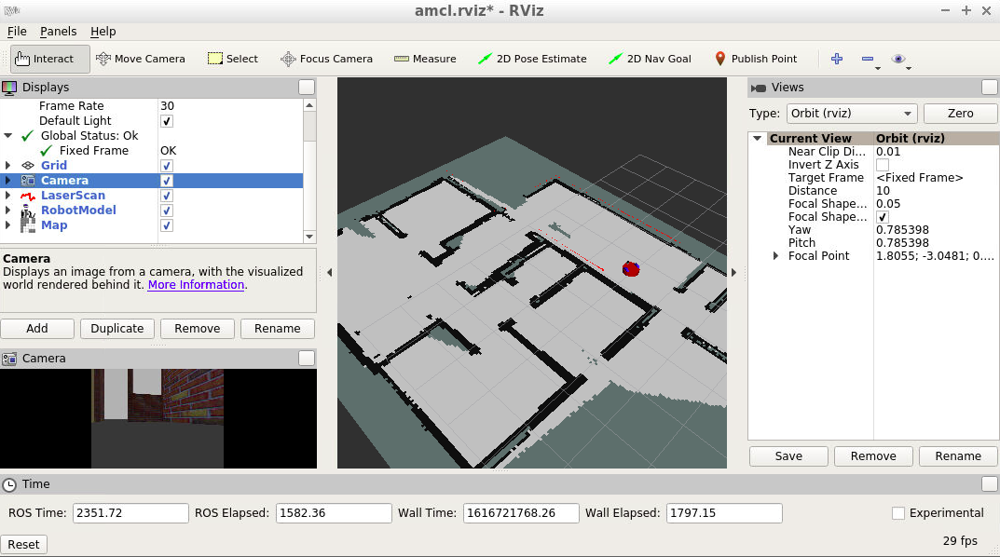
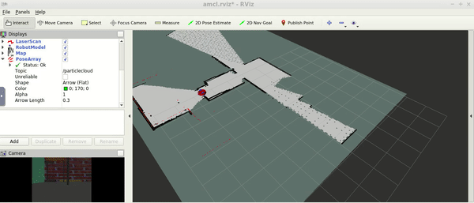

# Project 4 - Map My World

This repo contains the fourth project of the Robotics Software Engineer Nanodegree Program from Udacity. The program shows a robot which can perform SLAM (Simultaneous Localization and Mapping) using [rtabmap_ros package](http://wiki.ros.org/rtabmap_ros) . The mobile robot is operated with keyboard commands.

The image below shows the mapping process in rviz.

## Dependencies for Running
* cmake >= 3.5.1
  * Linux: [click here for installation instructions](https://cmake.org/install/)
* make >= 4.1 (Linux, Mac)
  * Linux: make is installed by default on most Linux distros
* gcc/g++ >= 5.4
  * Linux: gcc / g++ is installed by default on most Linux distros
* gazebo simulator >= 11.0.0
  * Linux: [gazebo download](http://gazebosim.org/download)
* ROS >= Kinetic
  *  Linux: [Ubuntu install of ROS Kinetic](http://wiki.ros.org/kinetic/Installation/Ubuntu)

## Basic Running Instructions

1. Clone this repo.
2. Open top level directory: `cd RobotND-MapMyWorld/catkin_ws`
3. Build the files: `catkin_make`
4. Execute in terminal: `source devel/setup.bash`
5. In terminal, launch the simulation environment (Gazebo and Rviz): `roslaunch my_robot world.launch`
6. In a new terminal, launch keyboard teleoperation: `roslaunch my_robot teleop.launch`. Make sure that `RobotND-MapMyWorld/catkin_ws/src/teleop_twist_keyboard/teleop_twist_keyboard.py` is executable.
7. In a new terminal, launch rtabmap: `roslaunch my_robot mapping.launch`
8. Ina a new terminal, launch the localication node: `roslaunch my_robot localization.launch`
9. Navigate through the map environment!

The created map is saved in database folder. You can access to database folder and opening the map with `rtabmap-databaseViewer rtabmap.db`. Then select `View -> Constrain View` and `View -> Graph View`.
